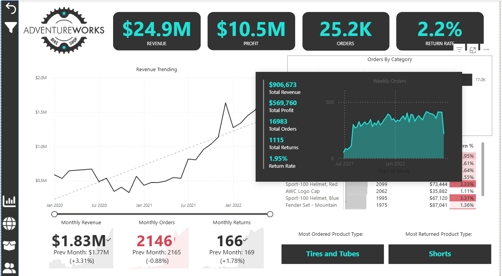
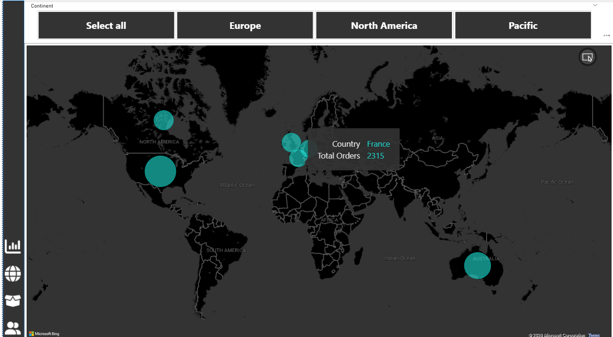
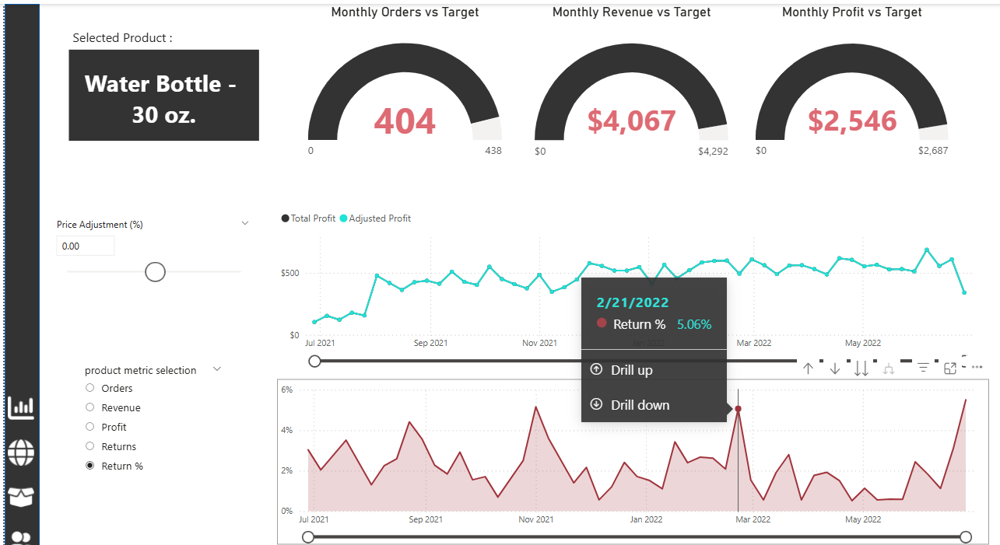
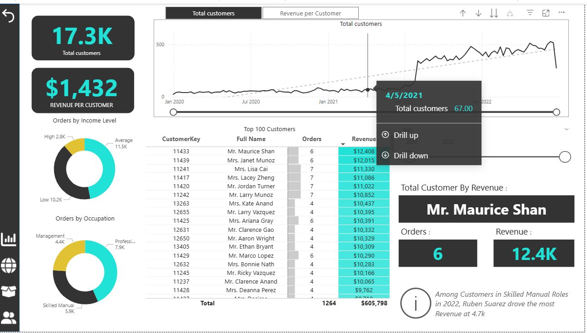

# 📊 AdventureWorks Sales Dashboard (Power BI)

## 📌 Project Overview
This project is an interactive Power BI dashboard analyzing sales performance using the AdventureWorks dataset.

The dashboard provides insights into revenue trends, customer behavior, product performance, and geographic distribution.

---

## 📊 Key Metrics
- Total Revenue: $24.9M  
- Total Profit: $10.5M  
- Total Orders: 25.2K  
- Return Rate: 2.2%  

---

## 📈 Dashboard Features

### 1. Revenue Analysis
- Monthly revenue trends
- Comparison with previous months
- Growth tracking over time

### 2. Product Analysis
- Top 10 products by orders and revenue
- Return rate per product
- Most ordered vs most returned categories

### 3. Geographic Analysis
- Sales distribution across continents:
  - North America
  - Europe
  - Pacific

### 4. Customer Insights
- Total customers: 17.3K  
- Revenue per customer: $1,432  
- Top 100 customers by revenue  
- Customer segmentation by income and occupation  

---

## 🎯 Business Insights
- Accessories generate the highest number of orders  
- Tires and tubes are the most ordered product type  
- Shorts have the highest return rate  
- Revenue shows a steady upward trend over time  

---

## 🛠 Tools Used
- Power BI  
- Data Modeling  
- DAX  
- Data Visualization  

---

## 📷 Dashboard Preview

---

## 📂 Files Included
- `.pbix` file (Power BI dashboard)
- Dashboard preview (PDF)
- Images for quick visualization

---

## 🚀 How to Use
1. Download the `.pbix` file  
2. Open using Power BI Desktop  
3. Interact with filters and visuals  

---

## 🔗 Author
Eyad Emara
